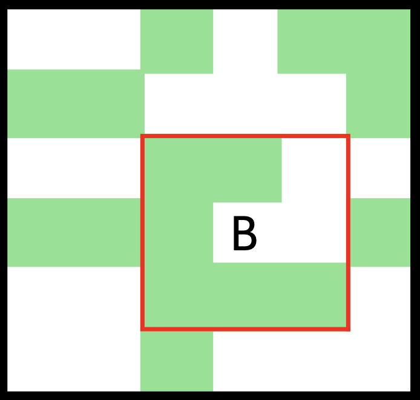
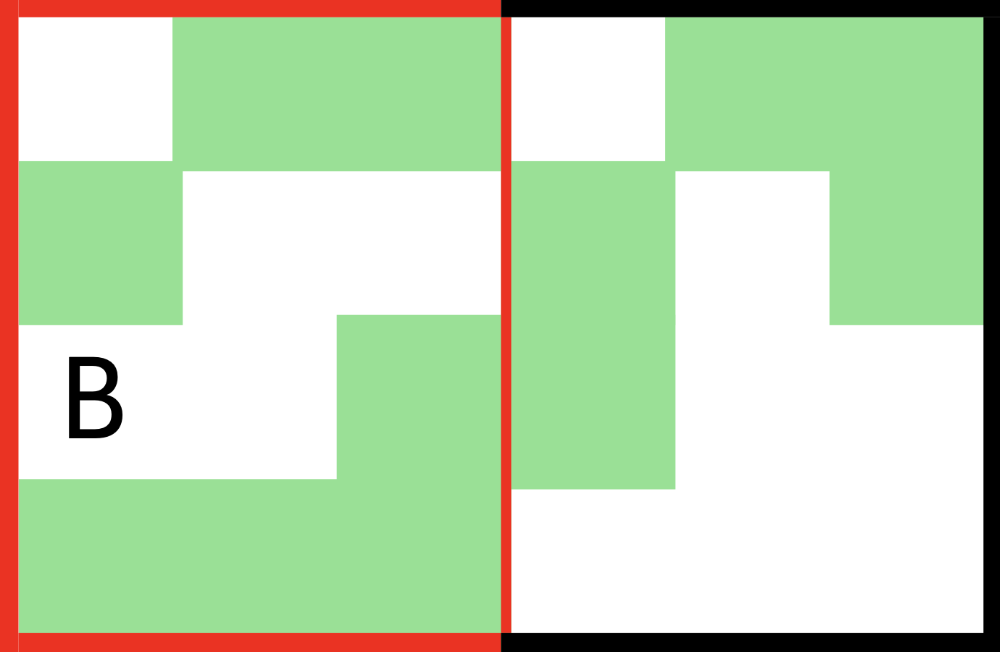

# Ronjenje

Berina vodi grupu ronioca na zaron u Jadranskom moru i zanima je koliko jata riba će vidjeti. Kada Berina sa svojom grupom zaroni obići će kvadrat veličine $N \times N$, centriran nad početnom tačkom. $N$ je neparan broj.

More je opisano kao matrica veličine $H \times W$ sa znakovima `*`, što označava jato riba, `.`, što označava more bez riba i jedno slovo `B`, što označava mjesto gdje će Berina zaroniti. 

Grupa neće zaroniti tačno iznad jata riba. Dva susjedna znaka `*` predstavljaju dva odvojena jata riba. Ako bi grupa trebala izaći van granica matrice to smatrate nepoznatim teritorijem i možete pretpostaviti da grupa neće tu roniti. Preporučujemo da pogledate primjere za dodatno razjašnjenje.

## Ulazni podaci
Prvi red ulaza sadrži razmakom razdvojene cijele brojeve $H$, $W$ i $N$, visinu matrice, širinu matrice i veličinu kvadrata koji će obići.

Idućih $H$ redova sadrži po $W$ znakova `*`, `.` ili `B`. Zagarantovano je da će se u matrici nalaziti tačno jedan znak `B`.

### Ograničenja
$1 \leq H, W \leq 100$

$1 \leq N \leq 9$

## Testni primjeri

Ovaj zadatak ne koristi podzadatke za bodovanje, već pojedinačne testne primjere koji nose po jednak broj bodova.

U testnim primjerima koji nose $8\%$ bodova vrijedi $N=1$, dok u testnim primjerima koji nose $20\%$ bodova vrijedi $N=3$.


## Izlazni podaci
Potrebno je ispisati jedan broj - broj jata riba koje će grupa vidjeti prilikom zarona.

## Primjeri
### Ulaz 1
```
6 6 3
..*.**
**...*
..**..
***B.*
..***.
..*...
```
### Izlaz 1
```
6
```
### Objašnjenje 1
Grupa će vidjeti jato riba na svakom od 9 dijelova zarona koje će pogledati osim: na mjestu gdje zaranjaju (slovo `B`), direktno istočno (desno) i sjevero-istočno (gore-desno).

Na slici ispod je prikazano područje koje će Berina obići. Osjenčeni kvadratići predstavljaju polja sa jatima. 



### Ulaz 2
```
4 6 5
.**.**
*..*.*
B.**..
***...
```
### Izlaz 2
```
7
```
### Objašnjenje 2
Ako izdvojimo dio oko koji će ronilačka grupa posjetiti dobijamo:
```
.**
*..
B.*
***
```

Dakle grupa će vidjeti 7 jata riba. Na slici ispod je prikazano područje.




### Ulaz 3 
```
2 3 9
B**
**.
```
### Izlaz 3
```
4
```
### Objašnjenje 3
Grupa će posjetiti sva jata na mapiranom moru.