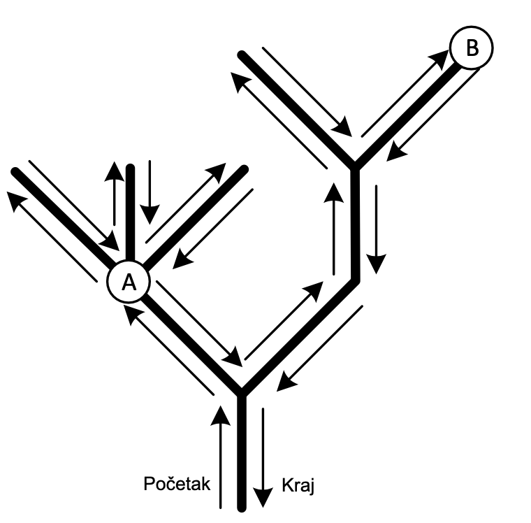

# Amazon

Zamislimo da mapiramo dio rijeke Amazon. Istraživači prate obalu rijeke i njenih pritoka, bilježeći svoj put. Rijeka je podijeljena na segmente dužine 1 metar.

Put istraživača se opisuje na sljedeći način:

*   Istraživači počinju na jednoj tački na obali i kreću se **uzvodno**, tako da im je rijeka uvijek sa desne strane.
*   Za svaki metar pređen uzvodno, bilježe slovo **U** (od *upstream*).
*   Kada dođu do izvora pritoke, okreću se i nastavljaju put **nizvodno** suprotnom obalom, držeći rijeku i dalje sa svoje desne strane.
*   Za svaki metar pređen nizvodno, bilježe slovo **D** (od *downstream*).
*   Kada naiđu na ušće nove pritoke, ne prelaze je, već nastavljaju uzvodno uz obalu te pritoke.
*   Mapiranje se završava kada se vrate na tačku na suprotnoj obali od one sa koje su krenuli.

Rezultat ovog procesa je string sastavljen od slova U i D. Sljedeća slika prikazuje primjer rijeke:



String koji opisuje ovu rijeku je `UUUDUDUDDUUUDUDDDD`. Tačka $A$ se nalazi nakon 2., 4., 6. i 8. metra koji su istraživači prešli. Tačka $B$ se nalazi nakon 14. metra koji su istraživači prešli.

Vaš zadatak je da za dati string i dvije tačke na putu istraživača, odredite najkraću udaljenost između te dvije tačke ako se putuje čamcem po vodi.

## Ulazni podaci
Prvi red sadrži dva cijela broja $A$ i $B$, tačke između kojih je potrebno odrediti udaljenost čamcem. Specifično, brojevi određuju nakon koliko metara putovanja su istraživači došli do opisane tačke.

Drugi red sadrži string $S$ sačinjen od slova `U` i `D` kojim je opisana rijeka.

### Ograničenja
$D(S)$ je dužina stringa $S$. 

$2 \leq D(S) < 1\;000\;000$

$0 \leq A, B \leq D(S)$

$S$ će uvijek počinjati slovom $U$, završavati slovom $D$ i imati jednak broj slova $U$ i $D$, te biti sačinjen isključivo od tih slova.

## Podzadaci

### Podzadatak 1 (14 bodova)
U stringu $S$ sva slova $U$ će se nalaziti prije svih slova $D$.

### Podzadatak 2 (18 bodova)
String $S$ se sastoji od naizmjeničnih slova $U$ i $D$ (npr. "UDUDUDUDUD").

### Podzadatak 3 (32 bodova)
$D(S) \leq 5\;000$

### Podzadatak 4 (36 boda)
Bez dodatnih ograničenja.

## Izlazni podaci
Potrebno je ispisati jedan cijeli broj: udaljenost u metrima između tačaka $A$ i $B$ kada se putuje čamcem.

## Primjeri
### Ulaz 1
```
4 14 
UUUDUDUDDUUUDUDDDD
```
### Izlaz 1
```
4
```
### Objašnjenje 1
Opisana rijeka je prikazana na slici u tekstu zadatka. Udaljenost čamcem između dvije tačke je 4.

### Ulaz 2
```
3 7
UUUUUUDDDDDD
```
### Izlaz 2
```
2
```
### Objašnjenje 2
Ovaj primjer odgovara podzadatku 1.

### Ulaz 3
```
14 3
UDUDUDUDUDUDUD
```
### Izlaz 3
```
1
```
