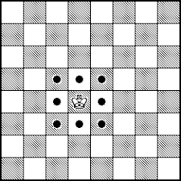
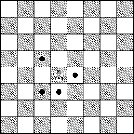

# Elena

Pored toga što igra šah, Elena riješava razne šahovske puzle. Godinama se zanimala za njih, takmičila se i eventualno počela je i da smišlja svoje.

Potrebna joj je vaša pomoć - napišite program koji će dati ispravan odgovor na Eleninu najnoviju puzlu.

Na šahovskoj ploči sa $R$ redova i $K$ kolona Elena neka polja označi kao _zauzeta_, dok su preostala polja _slobodna_. Dodatno, jedno od slobodnih polja označi kao ciljno polje.

Vaš zadatak će biti da postavite kralja na jedno polje. Podsjetimo, kralj se može pomjeriti na jedno od 8 susjednih polja - prikazano na slici ispod:



U Eleninoj igri to nije nužno slučaj, kralj će moći praviti samo neke od ovih 8 poteza. Na primjer, na slici ispod je prikazan ograničen skup poteza:



Elena zahtjeva od vas da odredite polje na koje treba postaviti kralja tako da bi $T = D \; \% \; (10^9+7)$ bio što veći, gdje je $D$ broj mogućnosti dolaska do ciljnog polja u __najviše__ $N$ poteza, a $\%$ predstavlja operaciju moduliranja, odnosno računanja ostatka pri djeljenju. $10^9+7$ je broj milijardu i sedam.

Kralj ne može napustiti ploču, ne može iskoristiti potez da ostane na mjestu i ne može stati na zauzeto polje.

Ukoliko ima više polja sa istim brojem T potrebno je izabrati ono najbliže gornjoj ivici ploče, a ukoliko je više i takvih potrebno je izabrati ono najbliže lijevoj ivici ploče.

Dva načina dolaska su različiti ako im se broj poteza razlikuje ili je bilo koji od poteza u putanji različit.

Napomena: način dolaska koji prolazi kroz cilj i kasnije se vrati do njega je __dozvoljen__.

## Ulazni podaci
Prvi red ulaza sadrži brojeve $R$ (broj redova ploče), $K$ (broj kolona ploče) i $N$ (maksimalni broj poteza kralja) razdvojene razmakom.\
Iduća $3$ reda će sadržavati po $3$ znaka - opis mogućih kraljevih poteza. `*` označava polje na koje se kralj može pomjeriti, `.` označava polje na koje ne može, a `K` označava kralja. Zagarantovano je da će se kralj nalaziti u sredini.\
Idućih $R$ redova sadrži po $K$ znakova `.` (slobodno polje), `#` (zauzeto polje) ili `C` (ciljno polje). Zagarantovano je da će se u ploči nalaziti tačno jedno ciljno polje.

### Ograničenja
$1 \leq R, K \leq 100$,

$0 \leq N \leq 1000$

## Podzadaci

### Podzadatak 1 (23 boda)
$R = 1$,

Svi potezi kralja su dostupni.

Sva polja ploče su slobodna.

### Podzadatak 2 (6 bodova)
$R = 1$,

$N \leq 3$

### Podzadatak 3 (21 bod)
$R = K = 8$,

Svi potezi kralja su dostupni.

Sva polja ploče su slobodna.

### Podzadatak 4 (19 bodova)
$R = K = 8$,

$N \leq 5$

### Podzadatak 5 (31 bod)
Bez dodatnih ograničenja.

## Izlazni podaci

U prvom redu izlaza potrebno je ispisati $R_{opt}$ i $K_{opt}$ razdvojene razmakom - broj reda i kolone odabranog polja.\
U drugom redu izlaza potrebno je ispisati broj $T$.

## Primjeri
### Ulaz 1
```
8 8 3
*..
.K*
**.
........
........
........
........
..C.....
........
........
........
```
### Izlaz 1
```
5 4
8
```
### Objašnjenje 1
Polje sa najvećim brojem mogućnosti je direktno desno od ciljnog, i odgovara polju kralja sa slika iznad. $8$ mogućih načina su: 
- Dolje, gore-lijevo - 2 poteza;
- Gore-lijevo, dolje - 2 poteza;
- Desno, gore-lijevo, dolje-lijevo - 3 poteza;
- Desno, dolje-lijevo, gore-lijevo - 3 poteza;
- Gore-lijevo, desno, dolje-lijevo - 3 poteza;
- Gore-lijevo, dolje-lijevo, desno - 3 poteza;
- Dolje-lijevo, desno, gore-lijevo - 3 poteza;
- Dolje-lijevo, gore-lijevo, desno - 3 poteza.


Ovaj primjer odgovara podzadacima 3, 4 i 5.

### Ulaz 2
```
1 8 2
***
*K*
***
...C....
```
### Izlaz 2
```
1 4
3
```
### Objašnjenje 2
Polje sa najvećim brojem mogućnosti je upravo ciljno polje. $3$ moguća načina su: 
- Bez poteza - 0 poteza;
- Lijevo, desno - 2 poteza;
- Desno, lijevo - 2 poteza.
Ovaj primjer odgovara podzadacima 1, 2 i 5.

### Ulaz 3
```
1 10 5
***
*K*
***
.C........
```
### Izlaz 3
```
1 3
13
```
### Objašnjenje 3
Ovaj primjer odgovara podzadacima 1, 2 i 5.

### Ulaz 4
```
8 8 5
.*.
*K.
*.*
........
.#.#....
.#..#...
..#.....
..C##...
.#.#..##
.....#..
.##.....
```
### Izlaz 4

```
3 3
15
```
### Objašnjenje 4
Ovaj primjer odgovara podzadacima 1, 2 i 5.
