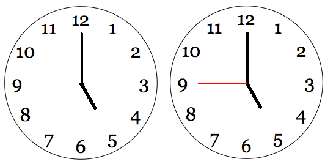
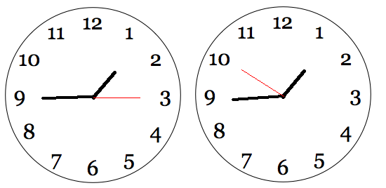

# Čudnovati sat

Na poklon ste dobili sat sa kazaljkama, no nešto je neobično oko ovog sata. Naime, kazaljka za minute se kreće u suprotnom smjeru.

Vaša mačka Smrdo je fascinirana ovim satom i primjetili ste da mjaukne kad god se neke dvije kazaljke preklope na satu. Kada se sve 3 kazaljke preklope Smrdo mjaukne 3 puta!

Ako znate da će Smrdo početi gledati sat u $H_1$ sati, $M_1$ minuta i $S_1$ sekundi, a prestati gledati sat nakon $D$ dana u $H_2$ sati, $M_2$ minuta i $S_2$ sekundi potrebno je ispisati broj puta koji će Smrdo mjauknuti. Ako $D=0$ to znači da će početi i prestati gledati sat u toku istog dana.

Kazaljke na satu se glatko kreću konstantnom brzinom i Smrdo neće ni početi ni prestati gledati sat u trenutku u kojem su neke 2 kazaljke preklopljene.

## Ulazni podaci

Prvi red ulaza se sastoji od 3 cijela broja $H_1$, $M_1$ i $S_1$, vrijeme na satu kada Smrdo počne gledati u sat.

Drugi red ulaza se sastoji od 1 cijelog broja $D$, broja dana između početka i prestanka gledanja.

Treći red ulaza se sastoji od 3 cijela broja $H_2$, $M_2$ i $S_2$, vrijeme na satu kada Smrdo prestane gledati u sat.

Ukoliko $D=0$ onda vrijeme $H_1$:$M_1$:$S_1$ je prije vremena $H_2$:$M_2$:$S_2$ u danu.

### Ograničenja
$0 \leq H_1, H_2 \leq 23$

$0 \leq M_1, M_2 \leq 59$

$0 \leq S_1, S_2 \leq 59$

$0 \leq D < 1\;000\;000$

## Testni primjeri

Ovaj zadatak ne koristi podzadatke za bodovanje, već pojedinačne testne primjere koji nose po jednak broj bodova.

U testnim primjerima koji nose $40\%$ bodova vrijedi $D=0$.

U testnim primjetima koji nose $35\%$ bodova vrijedi $0 < D < 1000$.

## Izlazni podaci

Potrebno je ispisati $N$, broj puta koji je Smrdo mjauknula. 

## Primjeri
### Ulaz 1
```
17 0 15
0
17 0 45
```
### Izlaz 1
```
1
```
### Objašnjenje 1
Kazaljka za sekunde će preći preko kazaljke za sate jednom u toku 30 sekundi koliko Smrdo gleda sat. Početna i krajnja pozicija su prikazane na slici ispod. Krataka kazaljka je kazaljka za sate, duga je kazaljka za minute i duga tanka je kazaljka za sekunde.



### Ulaz 2
```
1 15 15
0
1 16 50
```
### Izlaz 2
```
3
```
### Objašnjenje 2
Kazaljka za sekunde napravi približno krug i po, gdje se preklopi sa kazaljkom za sate jednom i kazaljkom za sekunde dva puta. Početna i krajnja pozicija su prikazane na slici ispod.




### Ulaz 3
```
11 59 59
0
12 0 1
```
### Izlaz 3
```
3
```
### Objašnjenje 3
Sve 3 kazaljke su se preklopile u podne. 

### Ulaz 4
```
0 3 3
255
8 8 3
```
### Izlaz 4
```
747625
```

