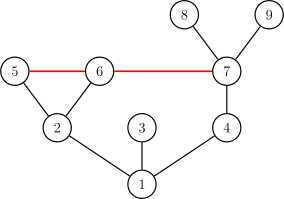

# Pneaumatske cijevi

Azur je napravio sistem pneumatskih cijevi pomoću kojih je povezao sve dijelove IOBIH d.o.o. fabrike. Sada, iz svake sobe u svaku drugu sobu možete poslati mali cilindrični paket brzo i jednostavno!

Svih `N` soba je međusobno povezao koristeći `N-1` dvosmjernu cijev. Potrebna je samo 1 sekunda da paket prođe kroz jednu cijev.

Azurova soba je središte mreže cijevi i označena je brojem `1`. Mreža cijevi kreće od Azurove sobe i širi se dalje prema ostalim sobama, sjeverno. Sobe su pobrojane po udaljenosti od Azurove, a ako sobe sa istom udaljenosti od Azurove su pobrojane sa zapada na istok.

Da bi se dodatno ubrzao protok paketa Azur razmatra dodavanje poprečnog niza cijevi, koji bi povezao susjedne sobe koje su na istoj udaljenosti od Azurove.

Pomozite mu tako što ćete odgovoriti na $Q$ Azurovih pitanja - koliko je minimalno potrebno vremena da se pošalje paket od sobe $a_i$ do sobe $b_i$, ako bi se dodao poprečni niz cijevi na udaljenosti $d_i$ od Azurove sobe?

## Ulazni podaci
Prvi red ulaza se sastoji od $N$ i $Q$, broja soba i broja Azurovih pitanja.

Idućih $N-1$ redova se sastoji od po 2 broja $u$ i $v$, koji označavaju da postoji cijev koja direktno povezuje sobe $u$ i $v$.

Idućih $Q$ redova se sastoji od brojeva $a_i$, $b_i$ i $d_i$ koji opisuju pitanje. Potrebno je ispisati minimalno potrebno vrijeme (u sekundama) da se paket pošalje iz sobe $a_i$ u sobu $b_i$ ako je poznato da je dodan poprečni niz cijevi na udaljenosti $d_i$ od Azurove sobe.

### Ograničenja
$3 \leq N \leq 2\;000$

$1 \leq Q \leq 500\;000$

$1 \leq a_i, b_i, d_i \leq N$

$a_i \neq b_i \; \forall$ (za sve)$ \; 1 \leq i \leq Q$

## Podzadaci

### Podzadatak 1 (5 bodova)
Sobe fabrike su samo poredane u liniju, odnosno ne postoje dvije različite sobe na istoj udaljenosti od Azurove.

### Podzadatak 2 (19 bodova)
$N \leq 300$

### Podzadatak 3 (20 bodova)
$Q \leq 2\;000$

### Podzadatak 4 (56 bodova)
Bez dodatnih ograničenja.

## Izlazni podaci
Za svako Azurovo pitanje potrebno je ispisati odgovor u obliku jednoj cijelog broja na odvojenoj linij.

## Primjeri
### Ulaz 1
```
9 4
1 2
1 3
1 4
2 5
2 6
4 7
7 8
7 9
2 8 2
6 5 2
5 4 2
1 7 4
```
### Izlaz 1
```
3
1
3
2
```
### Objašnjenje 1
Bez poprečnog niza cijevi raspored soba izgleda ovako:


Ako se doda poprečni niz cijevi (označen crvenom bojom) raspored soba izgleda ovako:



Za prvo pitanje, paket se može poslati između soba putanjom $2 \rightarrow 6 \rightarrow 7 \rightarrow 8$, čemu su potrebne 3 sekunde.

Za drugo pitanje, paket se može direktno poslati iz sobe 6 u sobu 5, dakle potrebna je 1 sekunda. 

Za treće pitanje, paket se može poslati putanjom $5 \rightarrow 6 \rightarrow 7 \rightarrow 4$, kao i putanjom $5 \rightarrow 2 \rightarrow 1 \rightarrow 4$, u oba slučaja su potrebne 3 sekunde.

Za četvrto pitanje, paket se može poslati putanjom $1 \rightarrow 4 \rightarrow 7$. Kako nema soba na udaljenosti 4 od Azurove tako nijedna nova cijev ne bi bila dodana. 