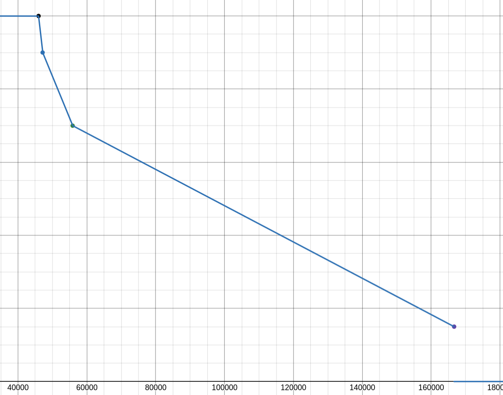

# Krempita

Faruk je za zadaću iz algoritama dobio zadatak da napiše program koji sortira niz nula i jedinica proizvoljne dužine. Takav niz nula i jedinica zovemo **binarni string** dužine $n$, a znakove na pozicijama $0, 1, \ldots, n-1$ zovemo **bitovi** stringa. Binarni string je sortiran ako su sve nule prije svih jedinica.

Nažalost, Faruk nije pratio predavanje jer je razmišljao o krempiti, pa ne zna konkretan string koji treba sortirati. Zato traži program koji radi ispravno za svaki mogući binarni string dužine $n$, a sastoji se isključivo od niza **uslovnih zamjena**. Uslovna zamjena $(A_i, B_i)$ zamijeni bitove na indeksima $A_i$ i $B_i$ samo ako je $S[A_i] > S[B_i]$, a inače ne radi ništa. Zamjene se izvršavaju redom, od prve do posljednje.

Faruk samo zna dužinu stringa $n$. Zadatak je pronaći niz uslovnih zamjena $(A_1, B_1), (A_2, B_2), \ldots, (A_M, B_M)$, gdje su $0 \le A_i, B_i \le n - 1$, takav da string $S$ bude sortiran (sve nule ispred svih jedinica) nakon što se sve zamjene izvrše, bez obzira na početni sadržaj stringa $S$.

Na primjer, za $n = 2$ dovoljan je niz od jedne zamjene $\{(0, 1)\}$. Ako je $S = 10$, tada je $S[0] = 1 > 0 = S[1]$, pa se bitovi zamijene i dobijemo $S = 01$. Za sve ostale stringove ($00$, $01$, $11$) zamjena se ne izvrši, a oni su već sortirani.

Pomozite Faruku da sastavi što manji niz zamjena.

## Ulazni podaci

U prvom redu nalazi se broj test-slučajeva $T$ ($1 \le T \le 99$).

U svakom od idućih $T$ redova nalazi se jedan cijeli broj $n_i$ ($2 \le n_i \le 100$) koji predstavlja dužinu binarnog stringa koji treba sortirati.

## Izlazni podaci

Za svaki test-slučaj ispisati u prvom redu broj zamjena $M_i$, a zatim $M_i$ redova od kojih svaki sadrži dva cijela broja $A_i$ i $B_i$ koji opisuju $i$-tu uslovnu zamjenu. Mora biti $M_i \le 10^4$.

## Bodovanje

Postoje 4 testna primjera. Prvi je isti kao primjer ispod i ne boduje se.

Drugi, treći i četvrti primjer jedini se boduju. Neka je $M = M_1 + \ldots + M_T$ ukupan broj zamjena korišten za određeni testni primjer.

| Broj testnog primjera | Opis primjera | Opis bodovanja |
| --- | --- | --- |
| 2 | $T=4$, $n_i = i + 1$ | $10 \cdot \max(0,\,(22-M))/4$ poena |
| 3 | $T=99$, $n_i=i+1$; za svaki string $S$ postoji indeks $k$ takav da važi $S[i] \le S[k]$ za $i < k$ i $S[i] \ge S[k]$ za $i > k$ | $20 \cdot f(M)$ poena |
| 4 | $T=99$, $n_i=i+1$ | $70 \cdot f(M)$ poena |

gdje je $f(M)$ definisana kao:


Grafik funkcije $f(M)$:


## Primjeri

### Ulaz 1
```
2
2
3
```

### Izlaz 1
```
1
0 1
3
0 2
0 1
1 2
```

### Objašnjenje 1

Za string dužine $2$ dovoljna je jedna zamjena $(0, 1)$, kao što je opisano u zadatku.

Za string dužine $3$: ako je $S = 010$, nakon zamjene $(0, 2)$ string ostaje $010$ (jer $S[0] = 0 = S[2]$, uslov nije ispunjen). Nakon zamjene $(0, 1)$ string ostaje $010$ (jer $S[0] = 0 < 1 = S[1]$, uslov nije ispunjen). Nakon zamjene $(1, 2)$ bitovi na indeksima $1$ i $2$ se zamijene jer $S[1] = 1 > 0 = S[2]$, pa dobijamo $S = 001$.

