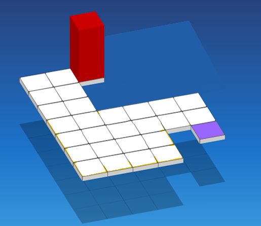

# Blok

Data je matrica dimenzija $H \times W$ koja predstavlja mrežu polja. Svako polje je ili slobodno (`.`), ili nije slobodno (`#`). Jedno slobodno polje je označeno sa `S` (start), a jedno sa `C` (cilj).

Na polju `S` stoji blok dimenzija $2 \times 1 \times 1$ u uspravnom položaju (zauzima samo jedno polje). Blok se može kotrljati u četiri smjera: gore, dolje, lijevo i desno.

Kada se blok kotrlja:
- Ako je u **uspravnom** položaju (zauzima 1 polje), prevrne se na stranu i zauzima 2 polja u smjeru kotrljanja.
- Ako leži **horizontalno u smjeru kotrljanja**, ustaje i zauzima 1 polje.
- Ako leži **horizontalno okomito na smjer kotrljanja**, pomiče se za jedno polje u tom smjeru i dalje zauzima 2 polja.

Blok se ne smije kotrljati van granica matrice niti na polje koje nije slobodno. Sva polja koja blok zauzima nakon kotrljanja moraju biti slobodna i unutar matrice.

Odredite da li je moguće dovesti blok od polja `S` do polja `C` tako da na kraju blok stoji uspravno na polju `C`.



## Ulazni podaci

U prvom redu se nalaze dva cijela broja $H$ i $W$: broj redova i kolona matrice.

U sljedećih $H$ redova se nalazi po $W$ znakova: opis matrice. Znakovi su `.` (slobodno polje), `#` (nije slobodno), `S` (start) ili `C` (cilj).

### Ograničenja

$1 \leq H, W \leq 500$

Matrica sadrži tačno jedno polje `S` i tačno jedno polje `C`.

## Podzadaci

### Podzadatak 1 (11 bodova)
$H = 1$

### Podzadatak 2 (11 bodova)
$H = 2$

### Podzadatak 3 (26 bodova)
$H = 3$

### Podzadatak 4 (24 bodova)
Sva polja su slobodna (nema `#` znakova u matrici).

### Podzadatak 5 (28 bodova)
Bez dodatnih ograničenja.

## Izlazni podaci

Na jedinoj liniji izlaza ispišite `DA` ako je moguće dovesti blok od `S` do `C`, ili `NE` u suprotnom.

## Primjeri

### Ulaz 1
```
4 4
S...
....
....
...C
```

### Izlaz 1
```
DA
```

### Objašnjenje 1

**Napomena**: u ovom i idućim objašnjenjima bit će podrazumjevano da su polja numerisana brojevima (R,K) gdje je R broj reda odozgo (povčevši od 0) i K broj kolona slijeva (počevši od 0).

Blok počinje uspravno na (0,0). Kotrlja se desno: prevrne se i zauzima (0,1) i (0,2). Kotrlja se desno: ustaje uspravno na (0,3). Kotrlja se dolje: prevrne se i zauzima (1,3) i (2,3). Opet se kotrlja dolje i upravlja se, stoji uspravno na (3,3). Blok sada stoji uspravno na polju `C`.

### Ulaz 2
```
3 5
S..#.
.....
...#C
```

### Izlaz 2
```
NE
```

### Objašnjenje 2

Iako postoje slobodna polja, polja koja nisu slobodna na pozicijama (0,3) i (2,3) blokiraju sve moguće puteve kojima blok može doći do cilja u uspravnom položaju.

### Ulaz 3
```
1 3
S.C
```

### Izlaz 3
```
NE
```

### Objašnjenje 3

U jednom redu, blok se kotrlja desno: iz uspravnog na (0,0) prevrne se i zauzima (0,1) i (0,2). Sada leži horizontalno. Kotrljanjem desno bi ustao na (0,3), ali to je van matrice. Kotrljanjem lijevo bi se vratio na (0,0). Ne može doći uspravno na (0,2).

### Ulaz 4
```
7 6
..S###
..####
..####
......
......
....#C
....##
```

### Izlaz 4
```
DA
```

### Objašnjenje 4

Ovo je primjer sa slike iz teksta zadatka. Jedan način na koji može doći do kraja je da se kotrlja:
1. Lijevo - zauzima (0,0) i (0,1)
1. Dolje - zauzima (1,0) i (1,1)
1. Dolje - zauzima (2,0) i (2,1)
1. Dolje - zauzima (3,0) i (3,1)
1. Dolje - zauzima (4,0) i (4,1)
1. Dolje - zauzima (5,0) i (5,1)
1. Desno - zauzima (5,2)
1. Gore - zauzima (3,2) i (4,2)
1. Desno - zauzima (3,3) i (4,3)
1. Desno - zauzima (3,4) i (4,4)
1. Desno - zauzima (3,5) i (4,5)
1. Dolje - zauzima (5,5), što je ciljno polje u uspravnom položaju.
