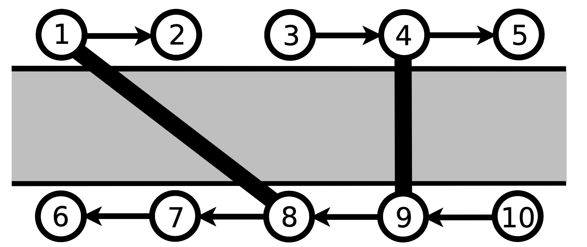

# Mostovi

U nekoj državi postoji $2N$ gradova i jedna dugačka rijeka koja se proteže od zapada prema istoku. Sa svake strane rijeke nalazi se $N$ gradova. Na sjevernoj strani oni su označeni brojevima od $1$ do $N$ od zapada prema istoku, a na južnoj strani brojevima $N + 1$ do $2N$ od zapada prema istoku.

Na sjevernoj obali postoji jednosmjerna cesta od svakog grada (osim grada $N$) do njemu najbližeg grada istočno. Na južnoj obali postoji jednosmjerna cesta od svakog grada (osim grada $N + 1$) do njemu najbližeg grada zapadno.



Budući da su vrlo prometne, ceste se ponekad istroše pa ih se zbog sigurnosti trajno blokira. Kako bi omogućili povezanost gradova, nadležni s vremenom grade mostove koji direktno povezuju dva grada na suprotnim stranama rijeke. Izgradnja mosta je financijski zahtjevna pa se oni grade s posebnom pažnjom kako se nikad ne bi istrošili. Iz istog razloga mostovi su dvosmjerni, za razliku od jeftinih cesta na obalama rijeke. Dodatno, izgrađeni mostovi se nikad ne presijecaju, čak ni u svojim krajnjim gradovima, pa će tako svaki grad biti direktno povezan mostom s najviše jednim gradom na drugoj strani rijeke.

Muamer radi na šalteru informacija vodeće autobusne kompanije. Svakog dana stotine ljudi mu dolazi s pitanjem može li se autobusom doći iz jednog grada u drugi. On tada baci oko na trenutno prohodne ceste i do sad izgrađene mostove i provjeri postoji li put od prvog do drugog grada. Ovaj posao mu se jako sviđa, no preklapa mu se s dnevnom limunadom koju obično pije svakog dana od 11 do 14 sati pa vas je zamolio da napišete program koji će ovaj posao raditi umjesto njega!

U početku su sve ceste slobodne, a niti jedan most nije izgrađen. Napišite program koji će simulirati $M$ događaja zadanih hronološkim redoslijedom. Svaki događaj je ili informacija o novoj blokiranoj cesti, ili informacija o novom izgrađenom mostu ili upit putnika o postojanju puta između neka dva grada.

Događaji su zadani u sljedećem obliku:

- `A G1 G2` -- Između gradova $G_1$ i $G_2$ je izgrađen most.
- `B G1 G2` -- Jednosmjerna cesta između gradova $G_1$ i $G_2$ se blokira.
- `Q G1 G2` -- Putnika zanima može li se trenutno raspoloživim cestama i mostovima stići od grada $G_1$ do grada $G_2$.

## Ulazni podaci

U prvom redu nalaze se prirodni brojevi $N$ ($1 \leq N \leq 10^9$) i $M$ ($1 \leq M \leq 200\;000$), broj gradova na jednoj strani rijeke i broj događaja.

U svakom od sljedećih $M$ redova nalazi se opis jednog događaja u formatu opisanom u tekstu zadatka. Za oznake gradova u događajima vrijedi $1 \leq G_1, G_2 \leq 2N$. Gradovi $G_1$ i $G_2$ će uvijek biti različiti.

Možete pretpostaviti da je cesta koja se blokira do tog trenutka bila slobodna, a most koji se gradi do tad nije postojao. Mostovi će se graditi samo između gradova na suprotnim stranama rijeke.

### Ograničenja

- $1 \leq N \leq 10^9$
- $1 \leq M \leq 200\;000$

## Testni primjeri

Ovaj zadatak ne koristi podzadatke za bodovanje, već pojedinačne testne primjere koji nose po jednak broj bodova.

U testnim primjerima koji nose $30\%$ bodova vrijedi $N, M \leq 1\;000$.

U testnim primjerima koji nose dodatnih $30\%$ bodova vrijedi $N \leq 10^9$, $M \leq 1\;000$.

## Izlazni podaci

Za svaki upit putnika potrebno je (u onom redoslijedu u kojem su upiti zadani) ispisati `DA` ukoliko postoji put od grada $G_1$ do grada $G_2$, a `NE` u suprotnom.

## Primjeri

### Ulaz 1
```
5 6
A 4 9
Q 1 7
B 3 2
Q 1 7
A 1 8
Q 1 7
```
### Izlaz 1
```
DA
NE
DA
```

### Ulaz 2
```
6 10
A 3 7
A 4 10
Q 1 11
A 12 5
Q 2 11
B 10 11
Q 2 10
Q 9 6
B 1 2
Q 1 2
```
### Izlaz 2
```
NE
DA
DA
DA
NE
```
